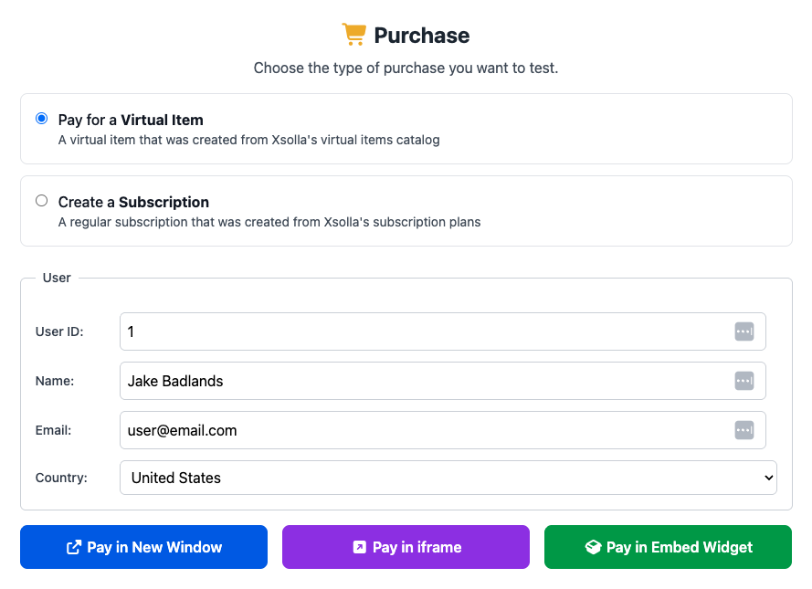
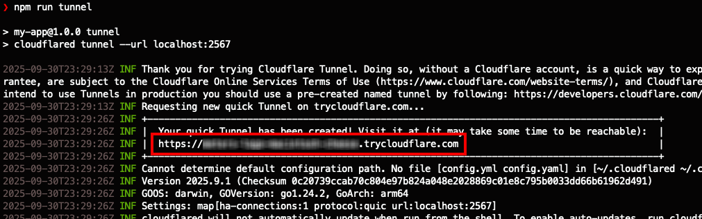
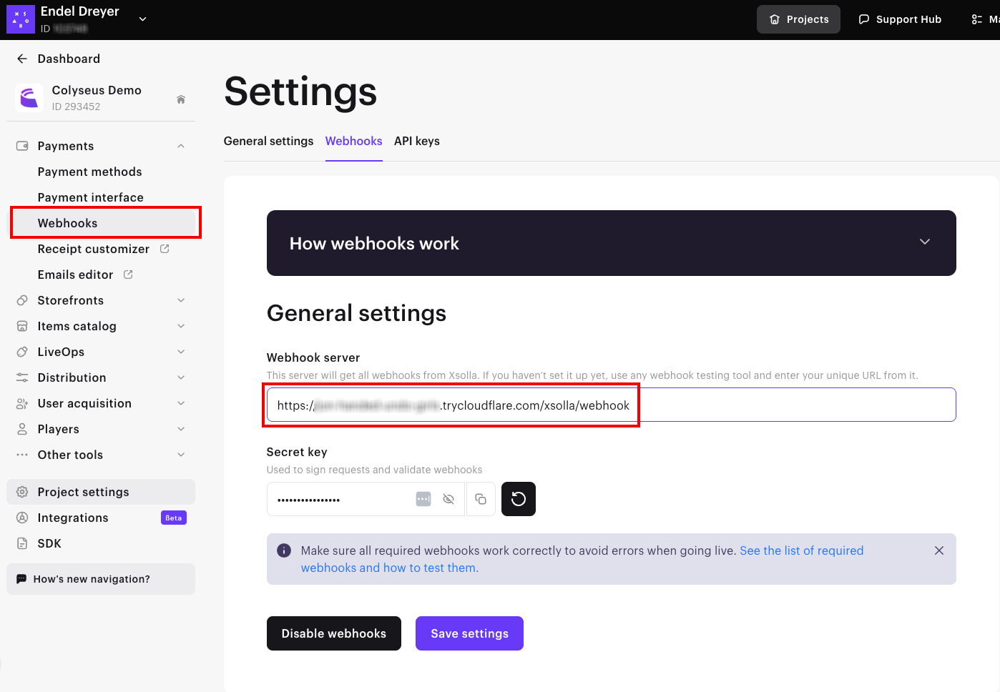

# Colyseus + Xsolla Integration

A simple integration between Colyseus and Xsolla for handling in-game payments. 

## Features

- **Token generation**: Payment token generation for Xsolla **Virtual Items** and **Subscriptions**
- **Pay Station UI**: The generated token is used to open the Xsolla **Pay Station** UI
- **Webhooks**: The Colyseus server responds to Xsolla **webhooks** for user validation and payment confirmation

    

> [!NOTE]
> See full documentation → http://docs.colyseus.io/payments/xsolla

## Testing payments locally

1. Install the dependencies
    - `npm install`
2. Start the local server
    - `npm start`
3. From a new terminal window, expose the local server to the internet via `cloudflared` tunnel, and copy the URL.
    - `npm run tunnel`   
4. From your Xsolla Dashboard, go to your project's **Payments → Webhooks** settings page and paste the tunnel URL.
    - 
5. Copy the updated **Secret key** and set it as the value for `XSOLLA_WEBHOOK_SECRET_KEY` in `.env.development`.

## License

MIT
